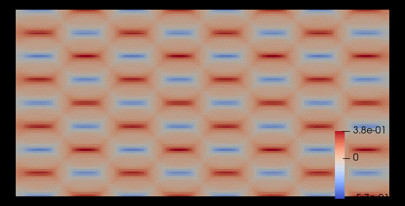

# LevelSetAdvection

# `LevelSetAdvection`

Julia code for Levelset advection using Gridap.jl

This is an example for Compliance minimization in the cantilever beam

#### Black means stiffer material than gray (ratio: 1e7)

#### Evolution of the implicit function

